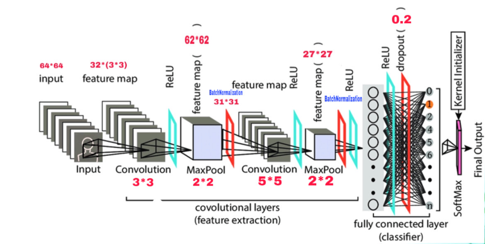
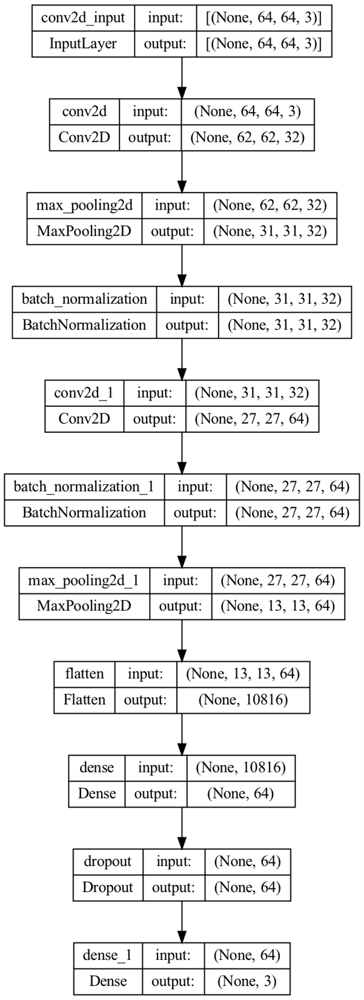
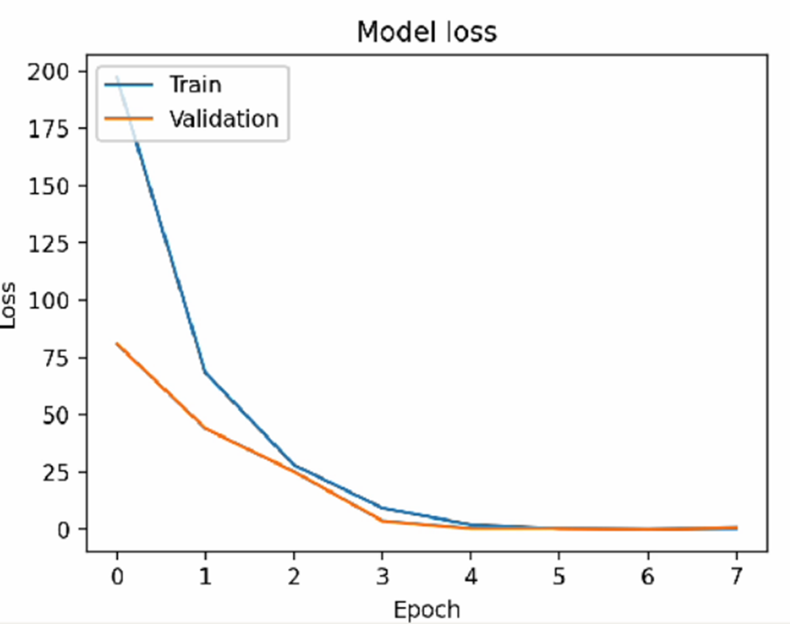

# 基于卷积神经网络的实时人脸识别系统设计

## 摘要
本文介绍了基于卷积神经网络（CNN）的实时人脸识别系统的设计与实现。通过使用TensorFlow和Keras库，我们训练了一个能够识别三个人脸的模型。实验结果显示，该模型在验证集上的准确率达到97%，在训练集上的准确率达到95%。本文将详细介绍研究背景、方法、实验过程、结果分析及总结，并探讨输入数据复杂程度与模型参数量之间的关系及其意义。

## 1. 研究背景
人脸识别技术在安防、金融、智能设备等领域有广泛应用。传统人脸识别方法依赖于手工特征提取，效果受限于特征提取的准确性和鲁棒性。卷积神经网络（CNN）在图像识别领域表现出色，可以自动学习图像特征，因此被广泛应用于人脸识别任务中。本次课程设计旨在通过实现一个基于CNN的实时人脸识别系统，加深对深度学习和图像处理技术的理解。

## 2. 方法介绍
本系统采用卷积神经网络（CNN）进行人脸识别，主要包括以下几个步骤：
1. **数据预处理**：收集并处理训练数据，进行数据增强。
2. **模型构建**：设计并构建CNN模型。
3. **模型训练**：使用训练集对模型进行训练，并在验证集上评估模型性能。
4. **模型保存与加载**：保存训练好的模型以便后续使用。

### 2.1 数据预处理
我们小组收集了三个人的200张64x64像素的正脸图片，利用`ImageDataGenerator`进行数据增强，包括训练集和验证集的划分（80%训练集，20%验证集）。

```python
datagen = ImageDataGenerator(validation_split=0.2)

TrainingImagePath = '/Users/lkh/Desktop/real time face detection/myFace'
train_set = datagen.flow_from_directory(TrainingImagePath, target_size=(64, 64), batch_size=32, class_mode='categorical', subset='training')
validation_set = datagen.flow_from_directory(TrainingImagePath, target_size=(64, 64), batch_size=32, class_mode='categorical', subset='validation')

TrainClasses = train_set.class_indices
ResultMap = {v: k for k, v in TrainClasses.items()}
with open('face_classes.pkl', 'wb') as fileWriteStream:
    pickle.dump(ResultMap, fileWriteStream)
OutputNeurons = len(ResultMap)
```

### 2.2 模型构建
构建一个包含两个卷积层和两个全连接层的CNN模型：



```python
classifier = Sequential()
classifier.add(Convolution2D(32, (3, 3), input_shape=(64, 64, 3), activation='relu'))
classifier.add(MaxPooling2D(pool_size=(2, 2)))
classifier.add(Convolution2D(64, (5, 5), activation='relu'))
classifier.add(MaxPooling2D(pool_size=(2, 2)))
classifier.add(Flatten())
classifier.add(Dense(64, activation='relu'))
classifier.add(Dense(OutputNeurons, activation='softmax'))
classifier.compile(optimizer='adam', loss='categorical_crossentropy', metrics=['accuracy'])
```

模型的数据维度变换过程:

### 2.3 模型训练
使用训练集训练模型，并在验证集上评估模型性能：

```python
history = classifier.fit_generator(train_set, steps_per_epoch=10, epochs=8, validation_data=validation_set, validation_steps=10)
```

### 2.4 模型保存
训练完成后保存模型以供后续使用：

```python
classifier.save('face_model.h5')
```

## 3. 实验过程
1. **数据准备**：收集三个人的200张正脸图片，并按照80:20的比例划分为训练集和验证集。
2. **模型训练**：使用训练集训练模型，共进行8个epoch，每个epoch包含10个步骤。
3. **性能评估**：记录训练集和验证集的准确率和损失值。

## 4. 实验结果及分析
训练过程中模型在验证集和训练集上的准确率和损失值如下：
- **训练集准确率**：46% -> 54% -> 47% -> 94% -> 97% -> 95%
- **验证集准确率**：48% -> 90% -> 97% -> 86%

从结果中可以看出，模型在第3个epoch时已经达到较高的准确率，并在第5个epoch时趋于稳定。验证集和训练集的准确率在第2个epoch时接近，表明模型开始收敛。在第5个epoch后误差几乎为零。

以下是训练过程中准确率和损失值的可视化图：



## 5. 讨论：输入数据复杂程度与模型参数量的关系
在深度学习模型中，输入数据的复杂程度和模型的参数量之间存在紧密的关系。对于复杂度较低的数据集，如本实验中的人脸识别数据集，较少的模型参数量可能已经足够。然而，随着输入数据的复杂程度增加，可能需要更多的参数来捕捉和表示数据中的复杂特征。

当模型的参数量大于所需的参数量时，模型可能会过拟合训练数据，导致在验证集上的性能下降。为了解决这个问题，我们可以使用一些正则化技术，如Dropout。Dropout通过在训练过程中随机忽略一部分神经元，使模型更加鲁棒，减少过拟合的风险。

### Dropout的应用
在我们的模型中，我们可以在全连接层中加入Dropout层来提高模型的泛化能力：

```python
classifier.add(Flatten())
classifier.add(Dense(64, activation='relu'))
classifier.add(Dropout(0.5))  # 添加Dropout层，丢弃50%的神经元
classifier.add(Dense(OutputNeurons, activation='softmax'))
```

使用Dropout可以使训练调优过程更容易，并提高模型在未知数据上的表现。

### 意义
对于我们的模型来说，使用Dropout等技术可以：
1. **减轻过拟合**：通过随机忽略部分神经元，强制模型在更少的特征上做出决策，从而减轻过拟合。
2. **提高鲁棒性**：模型在训练过程中不会依赖于某些特定的神经元，增强了模型的鲁棒性。
3. **优化训练过程**：使模型在训练过程中更容易找到全局最优解，而不是陷入局部最优。

通过这次实验，我们不仅掌握了CNN模型的构建和训练方法，也更加理解了输入数据复杂程度与模型参数量之间的关系及其对模型训练的影响。

## 6. 总结及心得体会
通过本次课程设计，我们成功实现了一个基于CNN的实时人脸识别系统。实验结果表明，该模型在正脸识别上具有较高的准确率，但在非正脸和复杂环境下仍有改进空间。未来的改进方向包括：
1. 增加数据集的样本量和多样性。
2. 增强模型对非正脸方向的识别能力。
3. 提升对图像中关键特征（如眼镜）的提取能力。
4. 在复杂环境下（如强光和低光）进行训练以提高鲁棒性。

通过本次设计，我们对深度学习的基本流程有了更深入的理解，掌握了CNN模型的构建和训练方法。同时，我们也认识到在实际应用中模型的局限性及改进方向。